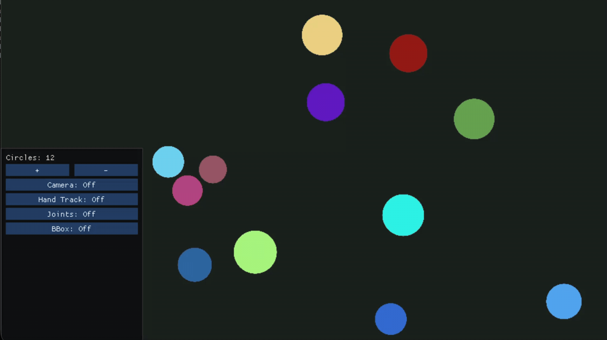

# Touch

#### This project includes custom hand detection and joint mapping models alongside an application that uses the trained models to process hand movements and gestures for object interactions

## Demo

     
     
     

